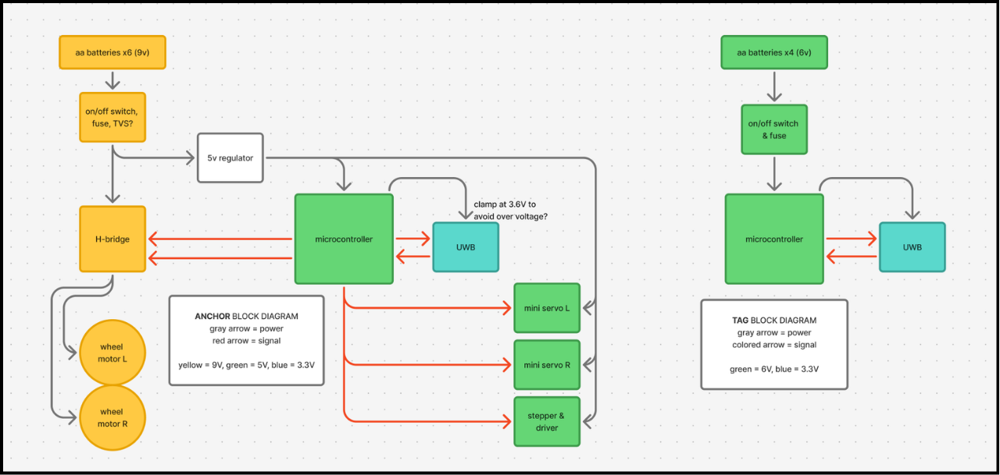

# Jeeves

An autonomous bed-making robot built on ESP32: it estimates its position using **UWB (ultra-wideband) triangulation**, tracks heading with an **onboard IMU**, drives toward a target with a closed-loop pursuit controller, and uses a **winch mechanism** to pull and tuck bedding.



## How it works

Four UWB anchors are placed at known positions (e.g. the corners of a bed). The robot polls distance readings from each anchor over UART and solves a least-squares triangulation (`triangulate()`) to estimate its `(x, y)` position.

Navigation is driven by `Robot::pursueTarget()`, a state machine with four phases:

1. **CALIBRATING** — drives forward briefly and measures actual displacement from the triangulated position to derive an initial heading (since position fixes alone don't give orientation).
2. **TURNING** — rotates in place, comparing current heading to the bearing toward the goal (`bearingToGoal()`), until the heading error is within tolerance.
3. **PURSUING** — drives straight toward the goal, continuously re-checking distance, until within the arrival threshold.
4. **DONE** — stops and holds position.

The `Robot` class wraps three subsystems behind this controller:

- **`Motors`** — TB6612FNG dual motor driver (`forward`/`backward`/`leftTurn`/`rightTurn`/`stopMotors`) over PWM (LEDC).
- **`Winch`** — 4-wire stepper driver for the bed-sheet mechanism, exposed as `windWinch()` / `releaseWinch()` / `unspool()`.
- **`MPU6050Sensor`** — DMP-based IMU giving yaw/pitch/roll for heading tracking.

Distance readings are cleaned up before they ever reach triangulation: `Anchor` runs each raw UWB reading through a `DistanceFilter` (spike rejection → median-of-3 → EMA) before triangulation ever sees it.

> The firmware in `main.cpp` is currently mid-tuning and drives navigation with a simpler, more direct single-anchor stepping loop rather than calling `pursueTarget()` end-to-end — but the `Robot`/`Motors`/`Winch`/`MPU6050Sensor` classes above are the core, reusable control layer the project is built on.

## Hardware

- **MCU**: ESP32
- **Localization**: UWB ranging module (RYUW), 4 fixed anchors
- **Heading**: MPU6050 IMU
- **Drive**: TB6612FNG dual motor driver + 2 servos (wheel lift/wiggle)
- **Bed-making mechanism**: 4-wire stepper-driven winch (2048 steps/rev)

## Repository layout

| Path | Purpose |
|---|---|
| `src/`, `include/` | PlatformIO firmware: `Robot`, `Anchor`, `Triangulation`, `Motors`, `Winch`, `MPU6050`, `Filter` |
| `TriangulationVisualizer.py` | Plots live `(x, y)` position streamed over serial, for debugging triangulation |
| `.ino Files/` | Earlier Arduino IDE sketches (`Anchor`, `Robot`, `AnchorRobot`), superseded by the PlatformIO project but kept for reference |

## Building

This is a [PlatformIO](https://platformio.org/) project targeting the `esp32dev` board.

```bash
pio run              # build
pio run -t upload    # flash
pio device monitor    # serial output (115200 baud)
```

To visualize position output live, run `TriangulationVisualizer.py` while the robot streams `x,y` over serial.
